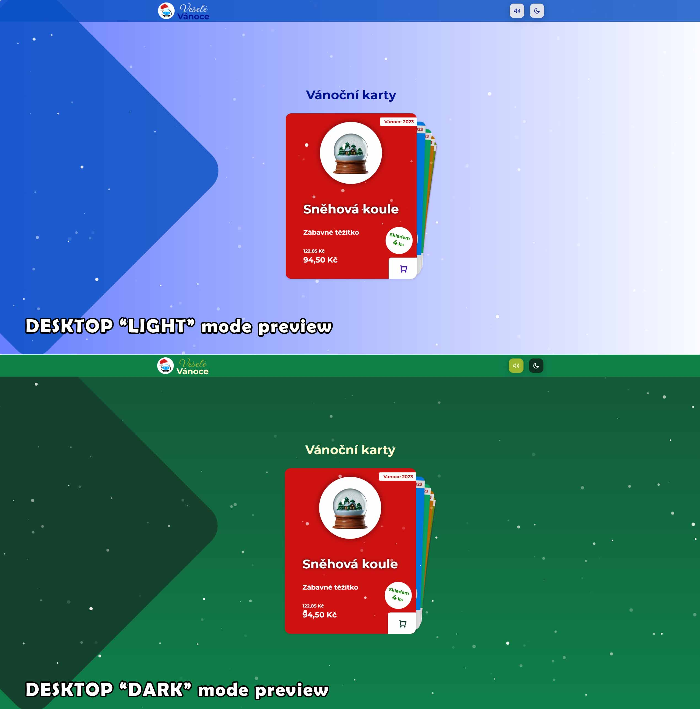
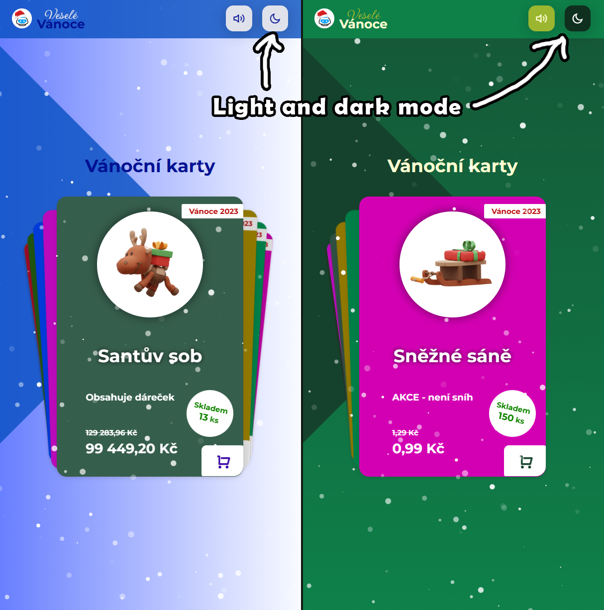
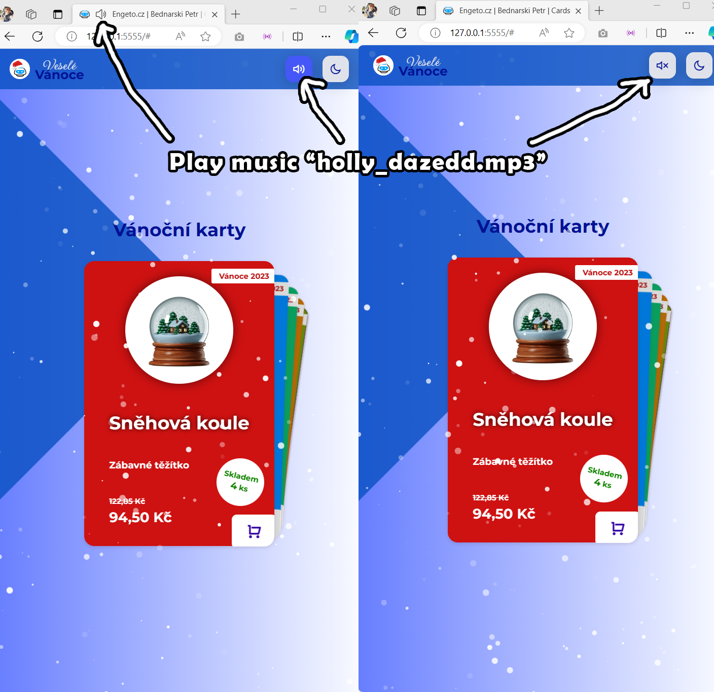
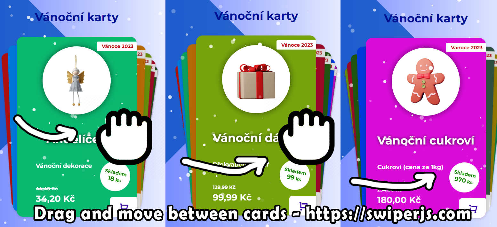

# CZ: ENGETO.CZ - #2 Domácí úkol - Produktová karta

## Zadání úkolu

### Bonusový úkol č. 2 (nepovinný)

Vytvořte produktovou kartu na libovolní produkt dle vlastního návrhu. Karta může vycházet z návrhu v bonusovém úkolu nebo projektu v lekci. Účelem úkolu je procvičit si probranou látku bez explicitního zadáni. 
Úkol můžete dle návodu v linku nahrát na Github a odkaz poslat lektorům do soukromé zprávy na Discordu. 

## Řešení

### Odkaz LIVE site 🌐🎄

Odkaz na HTML/CSS/JS stránku mého finálního řešení:

### ➡️ <b><a href="https://petrb-christmas-cards.netlify.app" target="_blank">https://petrb-christmas-cards.netlify.app 🎄</a></b> ⬅️

### Náhled řešení

#### Desktop verze 💻

#### Mobilní verze 📱

### Vlastnosti projektu

✅ <b>Responzivní design</b> - změna stylů se projeví při okně větší/menší než 968px 📲 / 🖥️ 
✅ Tlačítko v pravém horním rohu (🌔 měsíček/ 💡žárovka ) pro <b>změnu režimu</b> (<b>tmavý/zelený</b> a <b>modrý/světlý</b>) 
✅ Tlačítko pro MUTE/VOLUME 🎶 <b>PŘEHRÁNÍ HUDBY</b> uložené ve složce "assets/mp3/holly_dazedd.mp3" (hraje dokola) 
✅ Při kliknutí na <b>tlačítko košíku 🧺</b> u každé karty se zobrazí hláška pro uživatele, že nejde o <b>opravdový eshop</b> 
✅ Jednotlivé karty jsou <b>generovány pomocí Javascriptu</b> z pole "products" umístěným v souboru <b>"main.js"</b> 
✅ Cena po slevě je <b>přesně o 30% nižší</b> než původní cena  
✅ Na kartě na textu v pozici <b>cena</b> jsou tisíce <b>odděleny mezerou</b> (tak jak je v ČR zvykem) 

✅ Externí JS knihovny:

<ul>
<li> Knihovna <a href="https://embed.im/snow/" target="_blank">Snow effect JS</a> pro sněžení na stránce ❄️</li>
<li> Knihovna <a href="https://swiperjs.com/" target="_blank">Swiper </a> pro posunování/touch slide  mezi kartami 📲</li>
</ul> 

# EN: ENGETO.CZ - #2 Homework - Product card

## Task Description

### Bonus Task No. 2 (optional)

Create a product card for any product according to your own design. The card can be based on the design in the bonus task or the project in the lesson. The purpose of the task is to practice the covered material without an explicit assignment. 
You can upload the task to Github following the instructions in the link and send the link to the lecturers via private message on Discord. 

## Solution

### LIVE site link 🌐🎄

Link to the HTML/CSS/JS page of my final solution:

### ➡️ <b><a href="https://petrb-christmas-cards.netlify.app" target="_blank">https://petrb-christmas-cards.netlify.app 🎄</a></b> ⬅️

## Solution Preview

### Desktop version 💻

### Mobile version 📱

### Project Features

✅ <b>Responsive design</b> - style changes are reflected when the window is larger/smaller than 968px 📲 / 🖥️ 
✅ Button in the top right corner (🌔 moon/ 💡light bulb) for <b>mode change</b> (<b>dark/green</b> and <b>blue/light</b>) 
✅ Button for MUTE/VOLUME 🎶 <b>PLAY MUSIC</b> stored in the "assets/mp3/holly_dazedd.mp3" folder (plays on a loop) 
✅ Clicking on the <b>shopping basket 🧺</b> button on each card displays a message to the user that this is not a <b>real e-shop</b> 
✅ Individual cards are <b>generated using Javascript</b> from the "products" array located in the <b>"main.js"</b> file 
✅ The discounted price is <b>exactly 30% lower</b> than the original price 
✅ On the card, in the <b>price</b> position, thousands are <b>separated by a space</b> (as is customary in the Czech Republic) 

✅ External JS libraries:

<ul>
<li> <a href="https://embed.im/snow/" target="_blank">Snow effect JS</a> library for snow on the page ❄️</li>
<li> <a href="https://swiperjs.com/" target="_blank">Swiper </a> library for sliding/touch slide between cards 📲</li>
</ul> 
